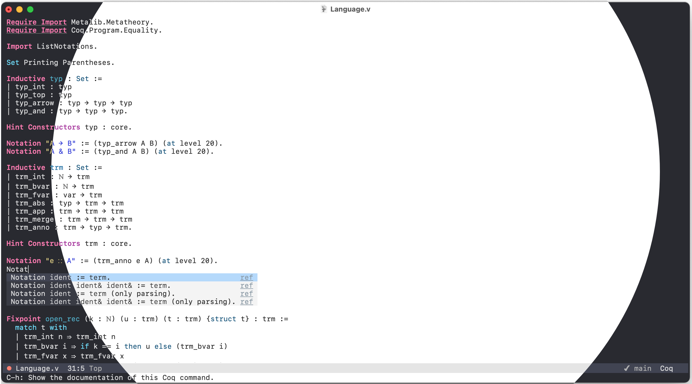

# Xcode Light/Dark Theme for Emacs

Xcode Light theme and Dark theme for GNU/Emacs.

**This repo is in the super-early stage!**



## Installation

Download this repo and put it in your `load-path`, and then add below code in your config.

```
(require 'xcode-light-theme)
(load-theme 'xcode-light t)

;; or

(require 'xcode-dark-theme)
(load-theme 'xcode-dark t)
```

for straight users,

```
(straight-use-package
 '(xcode-theme :type git :host github :repo "juniorxxue/xcode-theme"))
(require 'xcode-light-theme)
(load-theme 'xcode-light t)

;; or

(straight-use-package
 '(xcode-theme :type git :host github :repo "juniorxxue/xcode-theme"))
(require 'xcode-dark-theme)
(load-theme 'xcode-dark t)
```

## Design Principles

### Light

#### Background

| Item | Description                            | Custom      | Code    |
| ---- | -------------------------------------- | ----------- | ------- |
| bg1  | the whole canvas                       | white       | #ffffff |
| bg2  | modeline                               | grey        | #e5e5e5 |
| bg3  | selection form: completion, minibuffer | light grey  | #f4f4f4 |
| bg4  | selected item                          | blue        | #b4d8fd |
| bg5  | highlight                              | bright blue | #ecf5ff |
| bg6  | cursor                                 | black       | #262626 |

#### Foreground

| Item | Description                                | Custom         | Code    |
| ---- | ------------------------------------------ | -------------- | ------- |
| fg1  | base                                       | black          | #262626 |
| fg2  | builtin and keywords: define, let, in ...  | pink, semibold | #ad3da4 |
| fg3  | comment, doc, link                         | dark grey      | #8a99a6 |
| fg4  | function call                              | purple         | #4b21b0 |
| fg5  | function declaration, data constructor ... | TBD            | #0f68a0 |
| fg6  | constant: integer, string ...              | TBD            | #272ad8 |
| fg7  | types: Int, String ...                     | TBD            | #0b4f79 |
| fg8  | warning                                    | brown          | #78492a |
| fg9  | error                                      | red            | #d12f1b |
| fg10 | variable                                   | black          | #262626 |
| fg11 | border                                     | white          | #ffffff |

### Dark

#### Background

| Item | Description                            | Custom      | Code    |
| ---- | -------------------------------------- | ----------- | ------- |
| bg1  | the whole canvas                       | dark        | #292a30 |
| bg2  | modeline                               | grey        | #414453 |
| bg3  | selection form: completion, minibuffer | light grey  | #393b44 |
| bg4  | selected item                          | blue        | #414453 |
| bg5  | highlight                              | bright blue | #0f5bca |
| bg6  | cursor                                 | black       | #dfdfe0 |

#### Foreground

| Item | Description                                | Custom         | Code    |
| ---- | ------------------------------------------ | -------------- | ------- |
| fg1  | base                                       | black          | #dfdfe0 |
| fg2  | builtin and keywords: define, let, in ...  | pink, semibold | #ff7ab2 |
| fg3  | comment, doc, link                         | dark grey      | #7f8c98 |
| fg4  | function call                              | purple         | #b281eb |
| fg5  | function declaration, data constructor ... | TBD            | #4eb0cc |
| fg6  | constant: integer, string ...              | TBD            | #d9c97c |
| fg7  | types: Int, String ...                     | TBD            | #6bdfff |
| fg8  | warning                                    | brown          | #ffa14f |
| fg9  | error                                      | red            | #ff8170 |
| fg10 | variable                                   | black          | #dfdfe0 |
| fg11 | border                                     | white          | #292a30 |
