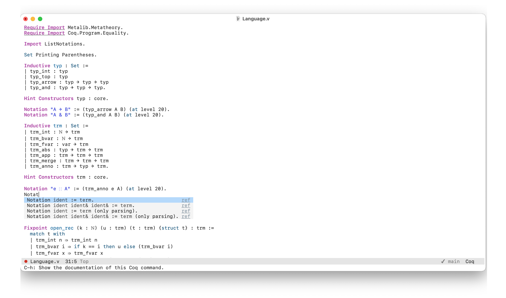

# Xcode Theme for Emacs

Xcode Light theme and Dark theme for GNU/Emacs.

**This repo is in the super-early stage!**

## Screenshot



## Installation

Download this repo and put it in your `load-path`, and then add below code in your config.

```
(require 'xcode-light-theme)
(load-theme 'xcode-light t)
```

for straight users,

```
(straight-use-package
 '(xcode-theme :type git :host github :repo "juniorxxue/xcode-theme"))
 
(require 'xcode-light-theme)
(load-theme 'xcode-light t)
```
